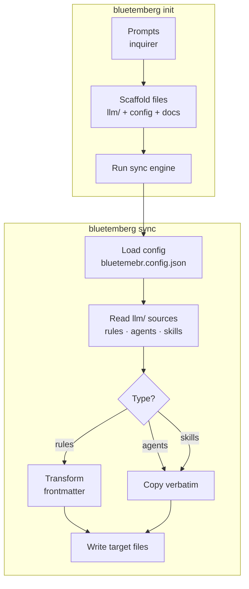
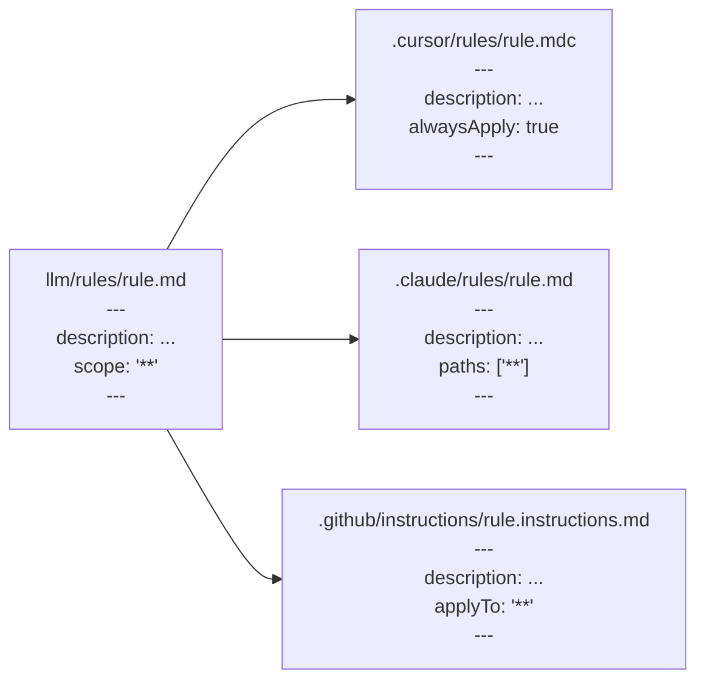
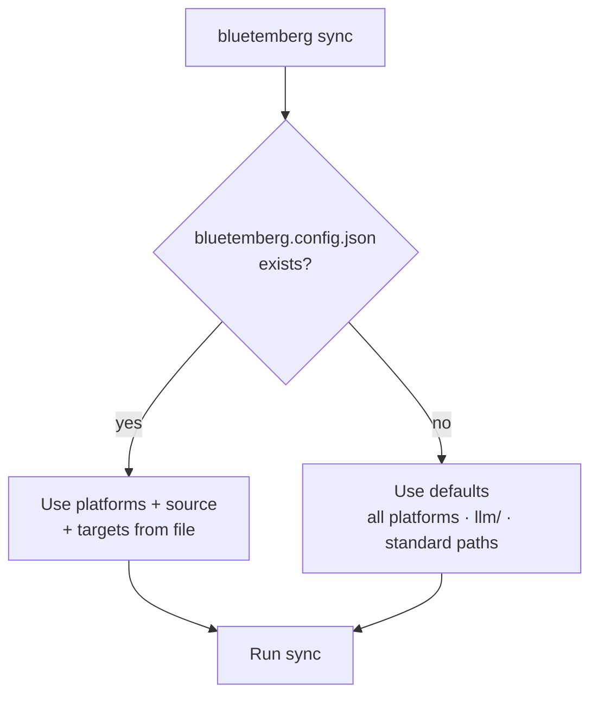

# Architecture

## Overview

Bluetemberg has two main components: the **init wizard** and the **sync engine**.



## Source directory structure

```
llm/
├── rules/              # Markdown with YAML frontmatter
│   ├── coding-standards.md
│   └── no-console-log.md
├── agents/             # Verbatim markdown (no transform)
│   └── frontend-specialist.md
└── skills/             # Directory per skill, each with SKILL.md
    └── patterns/
        └── SKILL.md
```

## Frontmatter transform

The core of the sync engine. Rules get platform-specific frontmatter; agents and skills are copied as-is.



| Source field      | Cursor output       | Claude output       | Copilot output      |
| ----------------- | ------------------- | ------------------- | ------------------- |
| `description`     | `description`       | `description`       | `description`       |
| `scope: '**'`     | `alwaysApply: true` | `paths: ['**']`     | `applyTo: '**'`     |
| `scope: 'src/**'` | `globs: ['src/**']` | `paths: ['src/**']` | `applyTo: 'src/**'` |

## File extension mapping

| Source     | Cursor     | Claude     | Copilot                |
| ---------- | ---------- | ---------- | ---------------------- |
| `rule.md`  | `rule.mdc` | `rule.md`  | `rule.instructions.md` |
| `agent.md` | —          | `agent.md` | `agent.agent.md`       |
| `SKILL.md` | —          | `SKILL.md` | `SKILL.md`             |

## Config resolution



## Special sync: AGENTS.md

`AGENTS.md` at the repo root is copied to `.github/copilot-instructions.md` — this is how GitHub Copilot reads project-level context.

## Check mode

`bluetemberg sync --check` performs a dry run: reads all sources, generates expected output in memory, compares against existing files. If any differ, it reports them and exits with code 1. No files are written.
