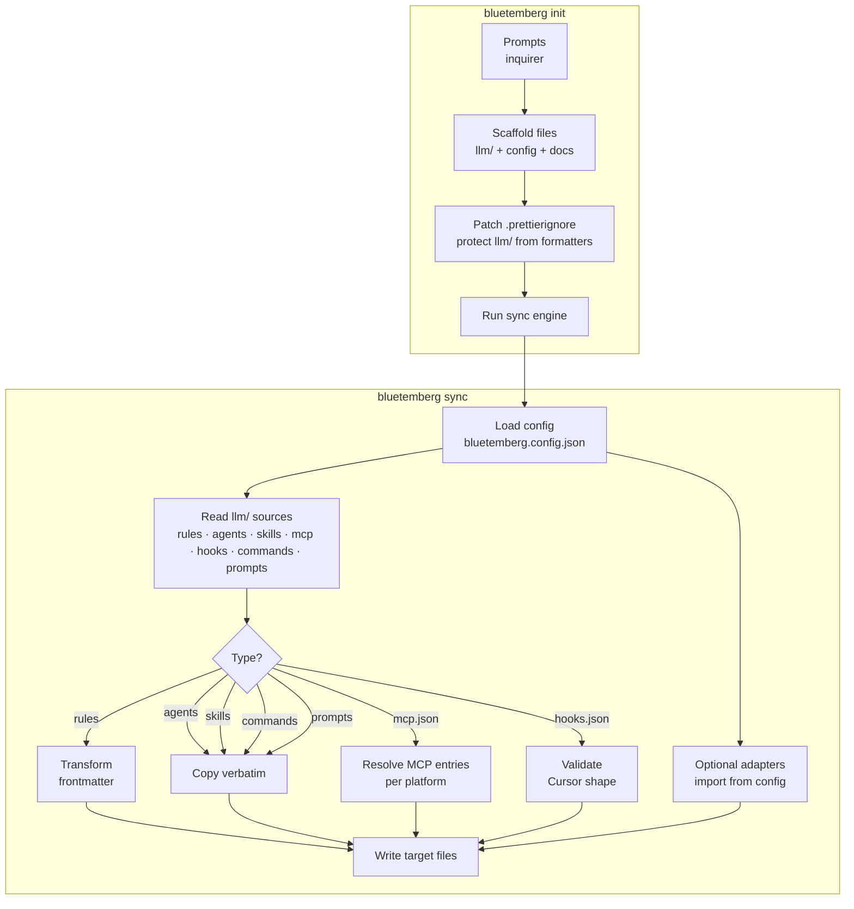
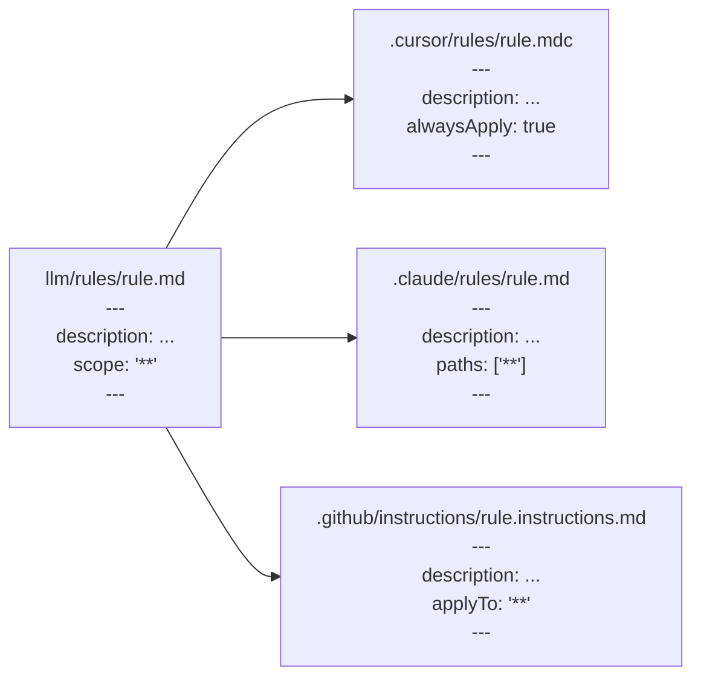
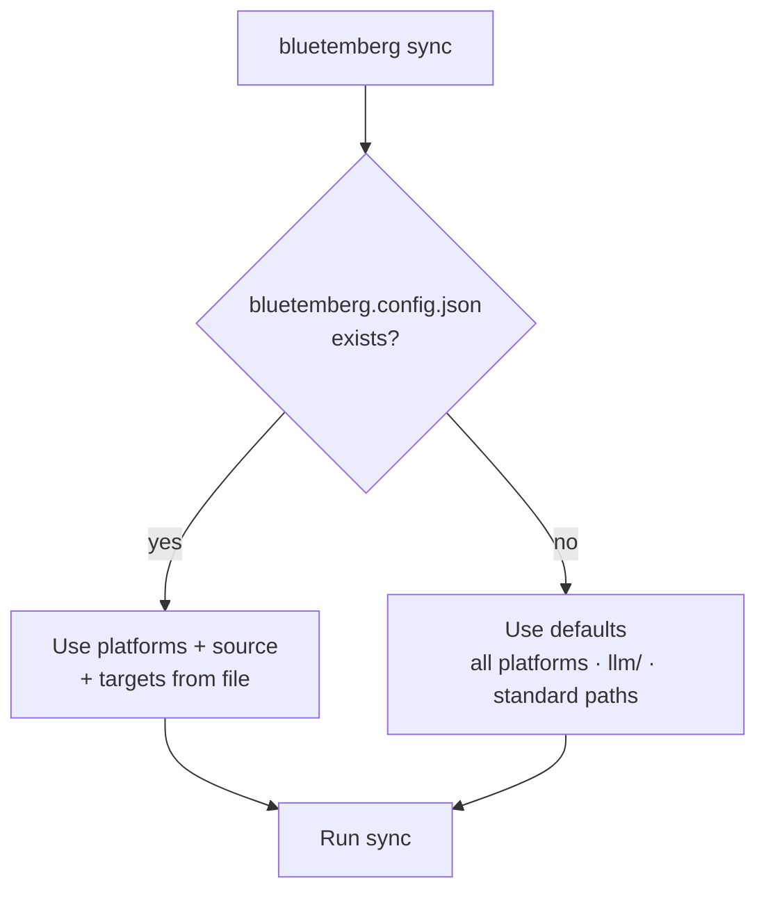

# Architecture

## Overview

Bluetemberg has two main components: the **init wizard** and the **sync engine**.



## Source directory structure

```
llm/
├── rules/              # Markdown with YAML frontmatter
│   ├── coding-standards.md
│   └── no-console-log.md
├── agents/             # Verbatim markdown (no transform)
│   └── frontend-specialist.md
├── skills/             # Directory per skill, each with SKILL.md
│   └── patterns/
│       └── SKILL.md
├── mcp.json            # Optional: preset ids and/or inline servers → per-platform mcp.json
├── hooks.json          # Optional: Cursor hooks → .cursor/hooks.json
├── commands/           # Optional: Claude slash commands → .claude/commands/*.md
└── prompts/            # Optional: Copilot prompts → .github/prompts/*.prompt.md
```

For optional sync extensions, MCP/hooks details, and roadmap, see [Adapters](Adapters).

## Frontmatter transform

The core of the sync engine. Rules get platform-specific frontmatter; agents and skills are copied as-is.



| Source field      | Cursor output       | Claude output       | Copilot output      |
| ----------------- | ------------------- | ------------------- | ------------------- |
| `description`     | `description`       | `description`       | `description`       |
| `scope: '**'`     | `alwaysApply: true` | `paths: ['**']`     | `applyTo: '**'`     |
| `scope: 'src/**'` | `globs: ['src/**']` | `paths: ['src/**']` | `applyTo: 'src/**'` |

## File extension mapping

| Source     | Cursor     | Claude     | Copilot                |
| ---------- | ---------- | ---------- | ---------------------- |
| `rule.md`  | `rule.mdc` | `rule.md`  | `rule.instructions.md` |
| `agent.md` | `agent.md` | `agent.md` | `agent.agent.md`       |
| `SKILL.md` | `SKILL.md` | `SKILL.md` | `SKILL.md`             |

## Rule tiers

Rules have three intent levels, not just on/off:

| Tier | Behavior | Examples |
| ---- | -------- | -------- |
| **Universal** | Always included, shown as `(required)` in the wizard, cannot be deselected | `pre-commit-checks`, `docs-parity`, `never-read-env` |
| **Team default** | Pre-checked for a given team profile, deselectable | `type-safety` (frontend/backend), `docker-best-practices` (devops) |
| **Team optional** | Off by default, opt-in | `terraform-conventions`, `no-console-log` |

Universal rules are marked `universal: true` in `src/init/presets.ts`. The init wizard merges their IDs into the final selection regardless of what the checkbox returns. See [Profiles](Profiles) for the full matrix of what each team profile includes.

## Config resolution



## Special sync: AGENTS.md

`AGENTS.md` at the repo root is copied to `.github/copilot-instructions.md` — this is how GitHub Copilot reads project-level context.

## Check mode

`bluetemberg sync --check` performs a dry run: reads all sources, generates expected output in memory, compares against existing files. If any differ, it reports them and exits with code 1. No files are written. Comparisons **normalize line endings** (CRLF vs LF) so check mode is less sensitive to platform checkout settings.

## Prune (optional)

`bluetemberg sync --prune` (write mode only) removes generated files under the **managed** output directories that were **not** produced in the current pass—useful after deleting or renaming sources under `llm/`. Prune runs only when the sync finishes with **no recorded errors**. See [Configuration](Configuration) for caveats (adapters, hand-edited files, `targets` paths).
