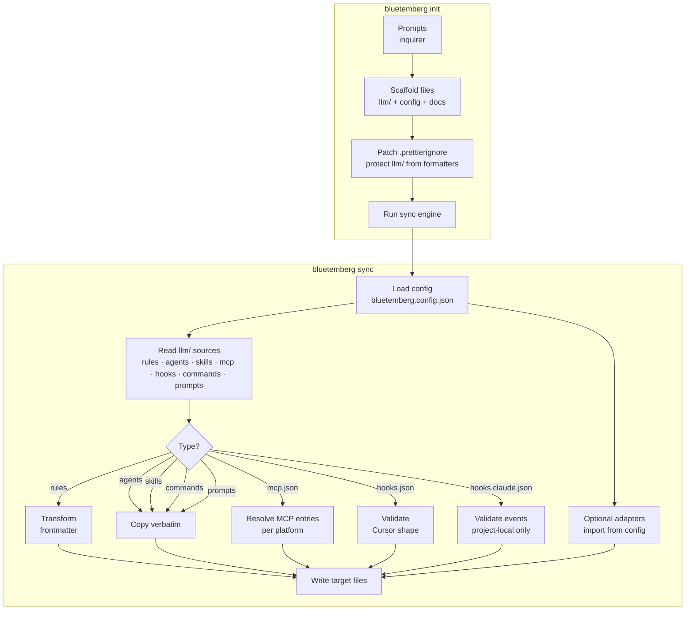
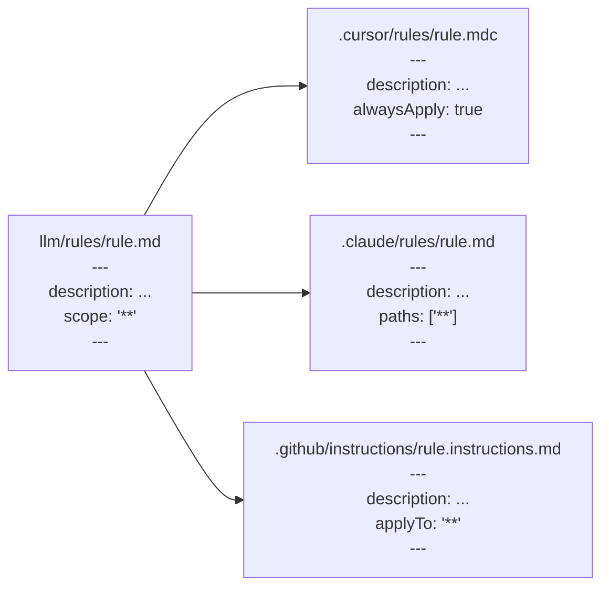
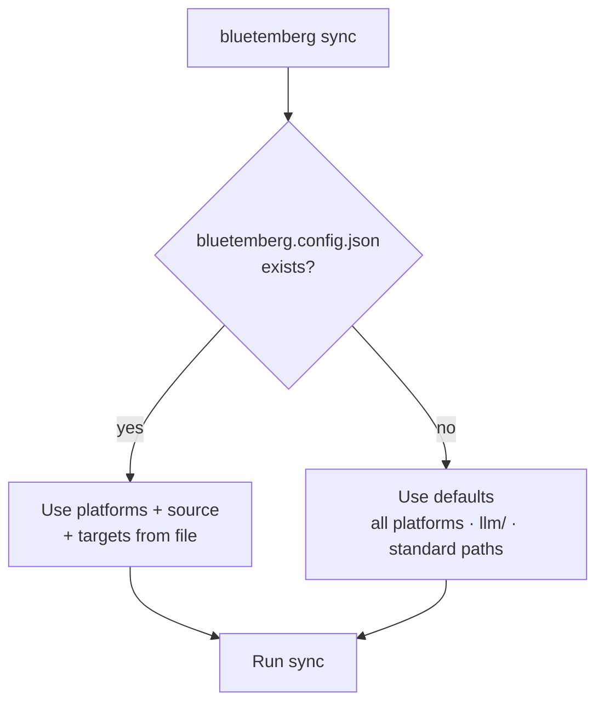

# Architecture

## Overview

Bluetemberg has two main components: the **init wizard** and the **sync engine**.



## Source directory structure

```
llm/
├── rules/              # Markdown with YAML frontmatter
│   ├── coding-standards.md
│   └── no-console-log.md
├── agents/             # Verbatim markdown (no transform)
│   └── frontend-specialist.md
├── skills/             # Directory per skill, each with SKILL.md
│   └── patterns/
│       └── SKILL.md
├── mcp.json            # Optional: preset ids and/or inline servers → per-platform mcp.json
├── hooks.json          # Optional: Cursor hooks → .cursor/hooks.json
├── hooks.claude.json   # Optional: Claude Code hooks → hooks key of .claude/settings.json (project-local only; packs cannot ship these)
├── commands/           # Optional: Claude slash commands → .claude/commands/*.md
└── prompts/            # Optional: Copilot prompts → .github/prompts/*.prompt.md
```

For optional sync extensions, MCP/hooks details, and roadmap, see [Adapters](Adapters).

## Frontmatter transform

The core of the sync engine. Rules get platform-specific frontmatter; agents and skills are copied as-is. (OpenAI Codex is the exception — its rules are folded into `AGENTS.md` as plain markdown with no transform; see [Special sync](#special-sync-agentsmd-and-openai-codex).)



| Source field      | Cursor output       | Claude output       | Copilot output      |
| ----------------- | ------------------- | ------------------- | ------------------- |
| `description`     | `description`       | `description`       | `description`       |
| `scope: '**'`     | `alwaysApply: true` | `paths: ['**']`     | `applyTo: '**'`     |
| `scope: 'src/**'` | `globs: ['src/**']` | `paths: ['src/**']` | `applyTo: 'src/**'` |

## File extension mapping

| Source     | Cursor     | Claude     | Copilot                |
| ---------- | ---------- | ---------- | ---------------------- |
| `rule.md`  | `rule.mdc` | `rule.md`  | `rule.instructions.md` |
| `agent.md` | `agent.md` | `agent.md` | `agent.agent.md`       |
| `SKILL.md` | `SKILL.md` | `SKILL.md` | `SKILL.md`             |

## Rule tiers

Rules have three intent levels, not just on/off:

| Tier | Behavior | Examples |
| ---- | -------- | -------- |
| **Collection default** | Pre-checked for a given team profile; the whole collection is toggled | `git`, `security`, `docs` (all profiles); `typescript` (frontend/backend/fullstack) |
| **Collection optional** | Available but not pre-checked for the profile | `nextjs` (backend), `devops` (frontend) |

Collections are curated in `src/init/presets.ts` as `RULE_COLLECTION_OVERLAYS` (id, display name, package name, description). Their **rule ids and profile tags are resolved from the catalog** (`catalog.json`) at load time via `resolveRuleCollections` — the engine does not hand-declare them, so they can never drift from the published packs. Agents and skills resolve the same way (`AGENT_OVERLAYS` / `SKILL_OVERLAYS` + `resolveAgents` / `resolveSkills`). The catalog is read from the project cache (`.bluetemberg/catalog.json`, refreshed on `install`/`update`/`add`) and falls back to a snapshot committed at `src/catalog/catalog.json` (run `npm run sync:catalog` to refresh it). See [Profiles](Profiles) for the full matrix.

## Config resolution



## Special sync: AGENTS.md and OpenAI Codex

`AGENTS.md` at the repo root is copied to `.github/copilot-instructions.md` (GitHub Copilot) and `GEMINI.md` (Gemini CLI) — this is how those tools read project-level context.

**OpenAI Codex** reads `AGENTS.md` natively, so the monolithic instructions need no derivation. Codex is also the one target whose rules do **not** go through the frontmatter transform: scoped rules from `llm/rules/` are folded into a fenced *managed block* in `AGENTS.md`, agents become per-file TOML under `.codex/agents/`, and MCP servers become a `[mcp_servers.*]` managed block in `.codex/config.toml`. Skills use the vendor-neutral `.agents/skills/`. Managed blocks (`src/sync/managed-block.ts`) preserve hand-authored content outside the markers and keep `sync --check` idempotent; the Codex rules block is stripped from the derived Copilot/Gemini instruction files.

### Malformed markers

Markers are paired positionally: each `BEGIN` is matched with the first `END` **after** it. An unpaired marker — a stray `END` with no `BEGIN` before it, a `BEGIN` with no `END` after it, or a `BEGIN` nested inside an open block — is what a hand-resolved merge conflict tends to leave behind, and there is no safe way to guess where the generated region was meant to start or stop. Sync therefore records an error naming the file, leaves it byte-for-byte untouched, and exits 1 with the fix in the message. Repair the markers (delete the stray one, or restore its pair) and re-run.

Duplicated blocks — both sides of a conflict kept, each with a matching pair — need no manual repair: the fenced region is generated content by definition, so sync collapses them into the first block and preserves everything between them.

Sync also refuses to **author** an unpairable block: a rule whose body quotes `<!-- BEGIN BLUETEMBERG MANAGED RULES -->` or its END counterpart verbatim is rejected before the first write, with an error naming the rule file. Without that check the marker would land inside the generated block, and no later run could pair it — not even after the rule was deleted, because the wreckage would already be on disk. Reword the rule so the literal marker does not appear (dropping the comment delimiters is enough).

## Check mode

`bluetemberg sync --check` performs a dry run: reads all sources, generates expected output in memory, compares against existing files. If any differ, it reports them and exits with code 1. No files are written. Comparisons **normalize line endings** (CRLF vs LF) so check mode is less sensitive to platform checkout settings.

## Prune (optional)

`bluetemberg sync --prune` (write mode only) removes generated files under the **managed** output directories that were **not** produced in the current pass—useful after deleting or renaming sources under `llm/`. Prune runs only when the sync finishes with **no recorded errors**. See [Configuration](Configuration) for caveats (adapters, hand-edited files, `targets` paths).
