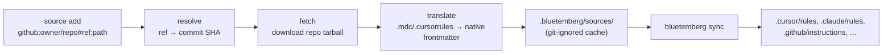

# Sources

**External rule sources** let Bluetemberg pull rules from outside its own npm pack registry — community repositories that publish rules in foreign formats — translate them into native Bluetemberg format, and include them during `sync`.

Where the [Registry](Registry) installs npm packs already written in Bluetemberg's `llm/` layout, **sources** target the wider ecosystem: a GitHub repo of `.cursorrules`/`.mdc` files, for example. Bluetemberg fetches, translates, caches, and pins them with the same reproducibility as packs.

> **Backend status:** GitHub repos are supported today. PRPM (`registry.prpm.dev`) and cursor.directory backends are planned follow-ups — the framework and CLI already accept their spec grammar, but `source add` for those types reports "not supported yet" until their adapters land.

## How it works



Translation happens once, at install time — the cache holds **native** `rules/`, `agents/`, and `skills/`, so `sync` treats a source exactly like any other source directory. A source is the **lowest** priority in the merge order:

```
local llm/  >  extends[]  >  npm packs  >  external sources
```

So a local rule always wins over an external rule with the same filename.

## Spec grammar

| Backend | Spec | Notes |
| ------- | ---- | ----- |
| GitHub | `github:<owner>/<repo>[#<ref>][:<path>]` | `ref` defaults to `HEAD` (the repo's default branch); `path` narrows to a subdirectory. |
| PRPM _(planned)_ | `prpm:<name>[@<range>]` | `range` defaults to `latest`. |
| cursor.directory _(planned)_ | `cursor-directory:<slug>` | `*` selects every active plugin. |

```bash
# The rules/ folder of awesome-cursorrules at its current default branch
bluetemberg source add "github:PatrickJS/awesome-cursorrules#HEAD:rules"

# A specific tag, whole-repo
bluetemberg source add "github:my-org/ai-rules#v2.1.0"
```

## Manifest and lockfile

Two committed files track sources (parallel to the registry's `rule-packages.json`):

| File | Purpose |
| ---- | ------- |
| `llm/rule-sources.json` | Manifest — declared sources keyed by a stable id, with the floating selector (branch/range). |
| `llm/rule-sources-lock.json` | Lockfile — the pinned ref (git **commit SHA** for GitHub), resolved URL, and integrity hash. |

Commit both so teammates resolve identical content. On a fresh clone, run `bluetemberg source install` to restore the cache from the lockfile.

The cache lives at `.bluetemberg/sources/<key>/<ref>/` and is added to `.gitignore` automatically.

## Translation

Foreign rule formats are mapped to native [`RuleFrontmatter`](Writing-Rules) (`description` + `scope`):

| Source frontmatter | Becomes |
| ------------------ | ------- |
| `.mdc` `alwaysApply: true` | `scope: "**"` |
| `.mdc` `globs: <pattern(s)>` | `scope: <pattern(s)>` |
| Plain `.cursorrules` (no frontmatter) | `description` synthesized from the first heading (or filename); `scope: "**"` |
| Already-native `.md` | passed through |

Real-world `.mdc` files often contain technically-invalid YAML (e.g. an unquoted glob whose leading `*` is read as a YAML alias). Bluetemberg repairs the common cases and, if a file's frontmatter is still unparseable, falls back to treating it as body-only — **a single malformed file never aborts a sync.**

A repo laid out with `rules/`, `agents/`, and/or `skills/` subdirectories is routed by category; a flat directory of files is treated as rules. Nested rule files are flattened into `rules/` (joined with `__`) because `sync` reads that directory non-recursively.

## Commands

See [Commands](Commands#bluetemberg-source-subcommand) for the full reference: `add`, `remove`, `list`, `install`, `update`, `search`.

## Security

Repo tarballs are extracted through the same hardened path as npm packs — symlink/hardlink entries and `..` path-traversal segments are rejected. Cache keys and filenames derived from remote input are sanitized to a single safe path segment.
