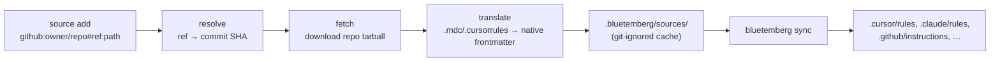

# Sources

**External rule sources** let Bluetemberg pull rules from outside its own npm pack registry — community repositories that publish rules in foreign formats — translate them into native Bluetemberg format, and include them during `sync`.

Where the [Registry](Registry) installs npm packs already written in Bluetemberg's `llm/` layout, **sources** target the wider ecosystem: a GitHub repo of `.cursorrules`/`.mdc` files, for example. Bluetemberg fetches, translates, caches, and pins them with the same reproducibility as packs.

> **Backend status:** GitHub repos, PRPM (`registry.prpm.dev`), and cursor.directory are all supported. cursor.directory works out of the box but is **experimental** (it uses an undocumented internal API whose key may rotate) — see its section below.

## How it works



Translation happens once, at install time — the cache holds **native** `rules/`, `agents/`, and `skills/`, so `sync` treats a source exactly like any other source directory. A source is the **lowest** priority in the merge order:

```
local llm/  >  extends[]  >  npm packs  >  external sources
```

So a local rule always wins over an external rule with the same filename.

## Spec grammar

| Backend | Spec | Notes |
| ------- | ---- | ----- |
| GitHub | `github:<owner>/<repo>[#<ref>][:<path>]` | `ref` defaults to `HEAD` (the repo's default branch); `path` narrows to a subdirectory. |
| PRPM | `prpm:<name>[@<range>]` | `range` defaults to `latest`. Each PRPM package is a single rule/agent/skill. |
| cursor.directory | `cursor-directory:<slug>` | Resolves the plugin's GitHub repo and fetches through the GitHub backend. Works out of the box; experimental (below). |

```bash
# The rules/ folder of awesome-cursorrules at its current default branch
bluetemberg source add "github:PatrickJS/awesome-cursorrules#HEAD:rules"

# A specific tag, whole-repo
bluetemberg source add "github:my-org/ai-rules#v2.1.0"

# Find and add a package from PRPM (resolved to a pinned version)
bluetemberg source search "react" --type prpm
bluetemberg source add "prpm:@patrickjs/nextjs-react-tailwind-cursorrules-prompt-file"
```

PRPM packages come in varied layouts (a structured `skills/<name>/SKILL.md`, or a single flat file); the PRPM adapter normalizes both into native dirs, routing by the package's declared `subtype`, before translation. The version is the immutable pin recorded in the lockfile.

### cursor.directory

> **Experimental.** This adapter talks to cursor.directory's undocumented internal API using a public *publishable* (anon) key whose value may rotate without notice. The first time you use it in a session, bluetemberg prints a one-time warning to stderr. `source search` degrades to an empty result if the backend is unreachable; `source add` fails loudly. If it stops working, the upstream key has likely rotated — override it (see below).

cursor.directory has no public content API: its rule-content table is locked by row-level security to its server (the public key can read plugin *metadata* but not rule bodies). Since every cursor.directory plugin is a GitHub repo, the adapter reads the plugin's `repository` from the public `plugins` table, then **fetches the actual rules through the GitHub backend** — so you still get real content with a reproducible commit-SHA pin.

It works out of the box — bluetemberg ships with cursor.directory's public Supabase URL + publishable key baked in, so no setup is required:

```bash
bluetemberg source search "nextjs" --type cursor-directory
bluetemberg source add "cursor-directory:<slug>"
```

cursor.directory has no version concept, so a plugin is pinned to its GitHub repo's **default-branch HEAD at add time** (locked to an immutable commit SHA in the lockfile); `bluetemberg source update` re-pins to the latest HEAD.

If the upstream key rotates and the adapter starts failing, override the baked defaults via env (find them in any `*.supabase.co` request in the site's browser network panel) — these are optional:

```bash
export BLUETEMBERG_CURSOR_DIRECTORY_URL="https://<project>.supabase.co"
export BLUETEMBERG_CURSOR_DIRECTORY_KEY="<publishable-key>"
```

(`github:` and `prpm:` sources need no configuration.)

## Manifest and lockfile

Two committed files track sources (parallel to the registry's `packages.json`):

| File | Purpose |
| ---- | ------- |
| `llm/rule-sources.json` | Manifest — declared sources keyed by a stable id, with the floating selector (branch/range). |
| `llm/rule-sources-lock.json` | Lockfile — the pinned ref (git **commit SHA** for GitHub), resolved URL, and integrity hash. |

Commit both so teammates resolve identical content. On a fresh clone, run `bluetemberg source install` to restore the cache from the lockfile.

The cache lives at `.bluetemberg/sources/<key>/<ref>/` and is added to `.gitignore` automatically.

## Translation

Foreign rule formats are mapped to native [`RuleFrontmatter`](Writing-Rules) (`description` + `scope`):

| Source frontmatter | Becomes |
| ------------------ | ------- |
| `.mdc` `alwaysApply: true` | `scope: "**"` |
| `.mdc` `globs: <pattern(s)>` | `scope: <pattern(s)>` |
| Plain `.cursorrules` (no frontmatter) | `description` synthesized from the first heading (or filename); `scope: "**"` |
| Already-native `.md` | passed through |

Real-world `.mdc` files often contain technically-invalid YAML (e.g. an unquoted glob whose leading `*` is read as a YAML alias). Bluetemberg repairs the common cases and, if a file's frontmatter is still unparseable, falls back to treating it as body-only — **a single malformed file never aborts a sync.**

A repo laid out with `rules/`, `agents/`, and/or `skills/` subdirectories is routed by category; a flat directory of files is treated as rules. Nested rule files are flattened into `rules/` (joined with `__`) because `sync` reads that directory non-recursively.

## Commands

See [Commands](Commands#bluetemberg-source-subcommand) for the full reference: `add`, `remove`, `list`, `install`, `update`, `search`.

## Private repos and rate limits

GitHub-backed sources (and cursor.directory, which resolves through GitHub) read
`GITHUB_TOKEN` — or `GH_TOKEN` — from the process environment. A token does two things:

- **Lifts the unauthenticated API rate limit** (60 requests/hour), which `source install` on a
  manifest with several GitHub sources can otherwise exhaust.
- **Unlocks private repositories**, letting a team distribute internal rules straight from a
  private repo without publishing a pack.

```bash
export GITHUB_TOKEN=ghp_...
bluetemberg source add github:acme/internal-rules:llm/rules
bluetemberg source install
```

In GitHub Actions the built-in token is enough for repos in the same org:

```yaml
- run: npx bluetemberg source install
  env:
    GITHUB_TOKEN: ${{ secrets.GITHUB_TOKEN }}
```

The token is read from the environment only — never from project files, and never recorded in the
manifest or lockfile. Unauthenticated, archives come from `codeload.github.com`, which is not
subject to the API rate limit. With a token the download goes through the REST archive endpoint
instead (`/repos/{owner}/{repo}/tarball/{ref}`), the only documented path that works for private
repos; it redirects to a short-lived signed URL, and the token is dropped at that cross-origin hop
rather than being handed to the CDN.

Registry credentials (`NPM_TOKEN`, `.npmrc`) are never sent to a source, and `GITHUB_TOKEN` is
never sent to a registry. See [Private registries](Registry#private-registries) for the pack side.

## Security

Repo tarballs are extracted through the same hardened path as npm packs — symlink/hardlink entries and `..` path-traversal segments are rejected (the extraction rejects cleanly rather than writing the offending entry). Downloads are size-capped and total extracted size is bounded, so a hostile or runaway archive can't fill the disk. Cache keys and filenames derived from remote input are sanitized to a single safe path segment.

For PRPM (immutable published versions) the lockfile integrity hash is re-verified on every reinstall; a mismatch aborts with a clear error. GitHub-backed sources (including cursor.directory) pin the **commit SHA** as the source of truth, since codeload archive bytes are not guaranteed stable over time.
