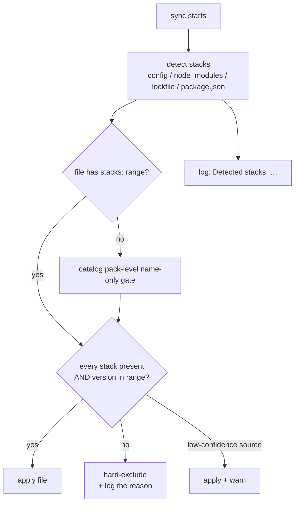

# Stacks & Versioning

Bluetemberg routes content along two orthogonal axes:

- **Profile** (the *role* you build in) — frontend, backend, full-stack. See [Profiles](Profiles).
- **Stack** (the *technology* you build with, and at which **version**) — `react`, `nextjs`, `payload`, … This page covers the stack axis and how version-aware routing works.

The goal: a rule written for Payload v3 should never reach a Payload v2 project, and a React 14 rule and a React 15 rule can coexist in one pack with the right one served to each project — automatically, and **visibly**.

## The model: stack name + range, never a versioned stack name

A stack is an open-vocabulary **name** (`react`). A version is a **constraint** layered on top via a semver range. There is no `react-14` stack — there is `react` plus a range like `>=14 <15`.

This appears in three places:

| Where | Field | Shape | Purpose |
|---|---|---|---|
| A project | [`stacks` config](Configuration#stacks) | `{ "react": "15.2.0" \| "auto" }` | Declares/pins what the project builds on |
| A rule / guardrail | [`stacks:` frontmatter](Writing-Rules#stacks-optional) | `{ react: ">=15 <16" }` | Declares which versions the content applies to |
| A catalog pack | `stacks` (name-only) | `["react"]` → `{ react: "*" }` | Coarse name-level routing; a file's own range refines it |

A file applies **iff every named stack is present in the project AND its detected version satisfies the range**. An absent/empty constraint is stack-agnostic and always applies — so a project with no stack-tagged content behaves exactly as a stackless project always did.

### React 14 and React 15, both valid — in one pack

```
bluetemberg-rules-react/
  rules/
    effects-r14.md   →  stacks: { react: ">=14 <15" }   # "use the old API"
    effects-r15.md   →  stacks: { react: ">=15 <16" }   # "use the new API"
    naming.md        →  (no stacks key)                 # universal — both get it
```

A React 14 project receives `effects-r14` + `naming`; a React 15 project receives `effects-r15` + `naming`. Both variants are maintained and valid; the gate serves the right one. A range is a full semver expression, so a single rule can also span versions explicitly: `react: "14.x || 16.x"`.

## Detection: where a version comes from, and how much we trust it

When a stack is not pinned in config (or is set to `"auto"`), Bluetemberg resolves its version per sync. Each detected stack carries a **confidence** and a **source**, in precedence order:

| Precedence | Source | Confidence | Notes |
|---|---|---|---|
| 1 | `bluetemberg.config.json` `stacks` (pinned, not `"auto"`) | `declared` | Asserted as fact — cheap and deterministic |
| 2 | `node_modules/<pkg>/package.json` | `exact` | The installed truth |
| 3 | `package-lock.json` | `exact` | Resolved lockfile version |
| 4 | `package.json` dependency range (coerced) | `coerced` | Low confidence — a range like `^15` coerces to its lowest anchor |

Inspect what the engine resolves with [`bluetemberg detect`](Commands#bluetemberg-detect-directory).



## Audible filtering — you can always see what the gate did

Filtering is a **trust signal**, not a silent side effect. A normal (non-`--silent`) sync reports exactly what it matched against and what it withheld:

```
Detected stacks: nextjs@15.2.0 (node_modules), payload@3.4.1 (config)

Rules: 12 source files
  10 applied · 2 filtered out by version
    - payload-collections: payload >=3 <4 (you're on 2.5.0)
    - next-rsc: nextjs not present

Guardrails: 1 filtered out by version
  - payload-2-only: payload >=2 <3 (you're on 3.4.1)
```

Three guarantees back this up — guidance is **never silently dropped**:

- **A typo'd range warns instead of vanishing.** An invalid range (`react: "15..16"`) would otherwise be dropped, silently widening the file to apply everywhere. Instead:
  ```
  WARN: rules/effects-r15.md: ignored invalid stack range(s) react: "15..16" — fix the range or the file may apply to unintended versions
  ```
- **A low-confidence match warns.** A version coerced from a `package.json` range still applies, but tells you to pin it:
  ```
  WARN: rules/payload-collections.md: matched via low-confidence detection for payload — pin a version in bluetemberg.config.json for precision
  ```
- **Every exclusion lists its reason** (rules and guardrails alike), so you can audit that wrong-version content was correctly withheld — hidden, not wrong-here.

## Versioning strategy: two tiers, mirroring the ecosystem

When a stack's guidance differs across versions, there are two established ways to model it. Bluetemberg follows both, at different scales — the same pattern TypeScript and DefinitelyTyped use:

| Tier | Pattern | Industry analog | Bluetemberg |
|---|---|---|---|
| **1** | One artifact, **version-keyed selector** — ship all variants, the consumer's version picks | TS [`typesVersions`](https://www.typescriptlang.org/docs/handbook/declaration-files/publishing.html); browserslist + `@babel/preset-env` | **Per-rule `stacks:` range** — available now |
| **2** | **Separate published version lines** — fork the package when the delta is too big for one | `@types/react@16` vs `@17` vs `@18`; `react-router@5` vs `@6` | `stackPeerDependencies` (pack version forks per stack) — *roadmap* |

The switch rule both ecosystems use: **use the in-artifact selector (Tier 1) until the divergence breaks it, then fork the version line (Tier 2).** For the React 14/15 case, Tier 1 is almost always sufficient — keep both rule sets in one pack and let the range gate serve each. Reach for Tier 2 only when one pack genuinely cannot hold both cleanly.

> Most AI-rules tools bake the framework version into prose ("you are an expert in React 19…"). Bluetemberg's structured, range-based gating — plus the audible output above — is the differentiator. Keep version a *constraint*, never part of a stack name.

## Known limits

Version-aware routing is maturing. Tracked in [issue #212](https://github.com/prototypdigital/bluetemberg/issues/212):

- **One version per stack name, per repo root.** A monorepo with `react@14` in one package and `react@15` in another resolves to a single version at the root, so per-package gating is not yet correct. Pin per-package via [config inheritance](Configuration#config-inheritance) as an interim measure.
- **Agents and skills are not version-gated** — only rules and guardrails. Stack-specific agent/skill advice cannot yet be withheld by version.
- **Cross-stack matching is AND-only.** "applies to A≥3 *or* B≥2" across two different stacks is not expressible (OR *within* one stack via `||` is).

## See also

- [Configuration → `stacks`](Configuration#stacks) — declaring/pinning project stacks
- [Writing Rules → `stacks`](Writing-Rules#stacks-optional) — the frontmatter constraint
- [Commands → `bluetemberg detect`](Commands#bluetemberg-detect-directory) — inspect resolved versions
- [Guardrails](Guardrails) — the same gate applies to guardrails
